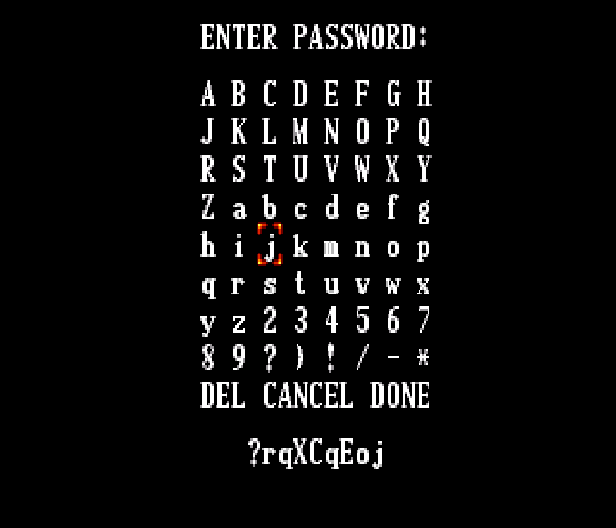
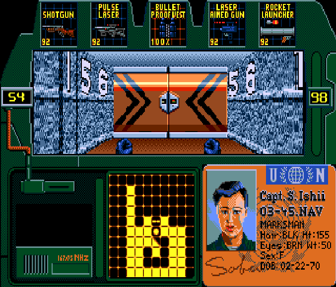
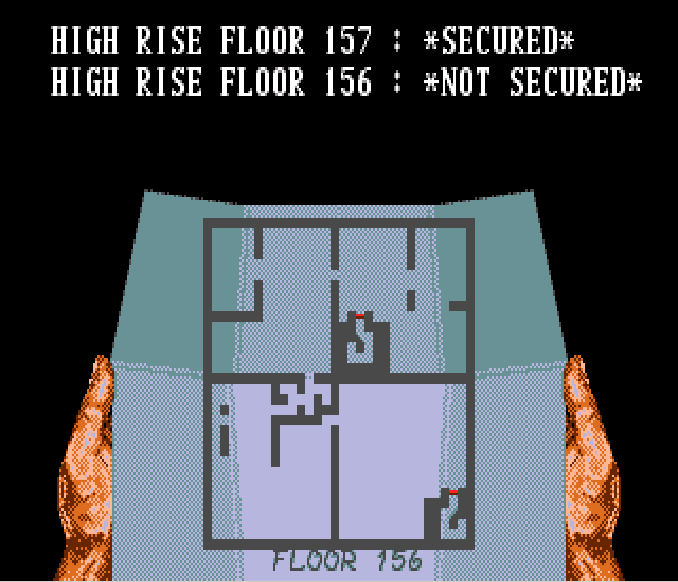

# ZeroTolerance_Password_Generator
My "HelloReverse" application, let me say, first view on the Motorola 68k assembly, this is reverse engineered algorithm of password generation in Sega game Zero Tolerance. Code is not ideal, but works.  

# Usage 
```
MacBook-Pro-mac:tmp mac$ ./a.out --help

	--help              This help message
	--health            Set health in percent from 10-100. Default 100.
	--level             Set level from level list.
	--gun[1,2,3,4,5]    Set from guns list below.
	--kill [0,1,2,3,4]  Set person to kill from the list, Default all persons alive.

-------------------------------------------------------
|                         LEVELS                      |
-------------------------------------------------------
| Docking Bay 2 |      0     | Bridge 1      |    1   |
| Engineering 1 |      2     | Engineering 2 |    3   |
| Engineering 3 |      4     | Engineering 4 |    5   |
| Green House 1 |      6     | Green House 2 |    7   |
| Green House 3 |      8     | Bridge 2      |    9   |
| Reactor 1     |     10     | Reactor 2     |   11   |
| Roof Top      |     15     |               |        |
| Floor 164     |     16     | Floor 163     |   17   |
| Floor 162     |     18     | Floor 161     |   19   |
| Floor 160     |     20     | Floor 159     |   21   |
| Floor 158     |     22     | Floor 157     |   23   |
| Floor 156     |     24     | Floor 155     |   25   |
| Floor 154     |     26     | Floor 153     |   27   |
| Floor 152     |     28     | Floor 151     |   29   |
| Basement 1    |     31     | Basement 2    |   32   |
| Basement 3    |     33     | Basement 4    |   34   |
| Basement 5    |     35     | Basement 6    |   36   |
| Basement 7    |     37     | Basement 8    |   38   |
| Basement 9    |     39     | Basement 10   |   40   |
| Basement 11   |     41     | Basement 12   |   42   |
-------------------------------------------------------


-----------------------------
|           GUNS            |
-----------------------------
| Bio Scanner         |  1  |
| Mine                |  2  |
| Boolet Proof Vest   |  3  |
| Fire Extinguisher   |  4  |
| Fire Proof Suit     |  5  |
| Flash Light         |  6  |
| Handgun             |  8  |
| Night Vision        |  9  |
| Laser Aimed Gun     | 10  |
| Rocket Launcher     | 11  |
| Shoutgun            | 12  |
| Flame Thrower       | 13  |
| Pulse Gun           | 14  |
-----------------------------

----------------------------------------------
|                   PERSONS                  |
----------------------------------------------
| Satoe Ishii   | 0   | Scot Haile | 1       |
| Justin Wolf   | 2   | Tony Ramos | 3       |
| Tomas Gjoerup | 4   |                      |
----------------------------------------------

----------------------------------------------
|             EMBEDDED PASSWORDS             |
----------------------------------------------
|  Highrise!  |   Basement!   |   Boxing!!!  |
----------------------------------------------
MacBook-Pro-mac:tmp mac$ ./a.out --level 24 --gun1 14 --gun2 12 --gun3 11 --gun4 10 --gun5 3
Password: [ ?rqXCqEoj ]
MacBook-Pro-mac:tmp mac$
```

# Result




